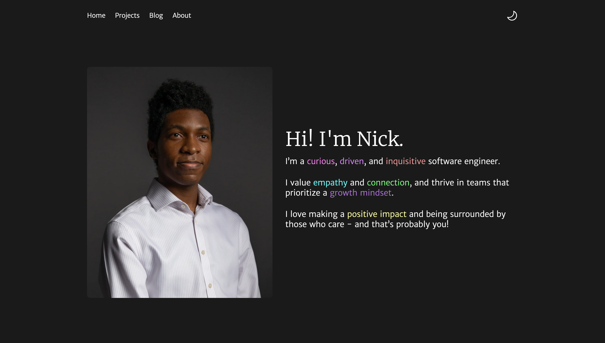

# My Personal Portfolio

I read a lot online about how you shouldn't put too much effort into your portfolio/blog. The truth is, it's really hard to not want to try and do something cool. So here's my compromise - I'll focus on practicality first. I'll make it functional and useful and not too hard to look at. And as I practice building in public, this blog will hopefully get a little prettier every time. But that means you have to promise to visit every once in a while, okay? Don't be a stranger!

## Tech Stack

- Astro
- Typescript
- CSS
- Vite (Build Tool)

I used Astro for this project, and I'm really enjoying it so far! I was a bit skeptical at first, but it honestly feels so nice to use and I genuinely think it's just good fun. Hopefully as time goes on I can use Astro to its full power.
