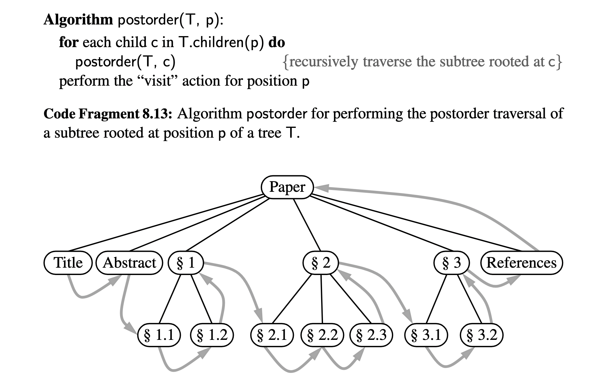
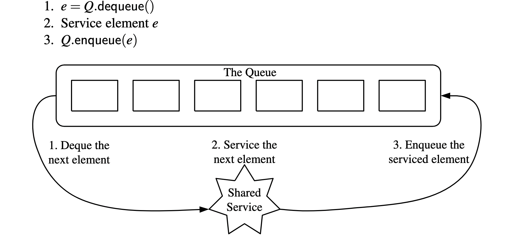

View the [code](https://github.com/nicholasboyce/tictactoe) for this blog post.

## Introduction
This past week on Halloween, I gave a presentation at the Recurse Center on what I learned about game trees and the minimax algorithm! And I promised to give a more in-depth technical explanation of the information presented.

## Minimax
Minimax is a decision making algorithm commonly used in game theory, statistics, artificial intelligence, and more.

In the context of an adversarial game (one where players play against each other) such as Tic-Tac-Toe (a.k.a. noughts and crosses), minimax can help us answer the following questions: "Given the current state of the game, and the available moves left for the current player, what is the value of the board? Which optimal value (decision/game state) should/will the current player choose?"

In other words, if you could know exactly what paths would lead you down to the results you want, what decisions would you make?

We can represent all the possibilities branching out from a given game state as a tree, where each edge is a decision/move and each node is a game state. The children of any given node are the resulting game states from each corresponding decision.

The "results" of the game (whether there's a winner or a draw) are the final states of the game, i.e. the leaves of the tree. So what we want to do is explore all the paths down to the leaves, and from the leaves we can "walk back" and bubble up the values to the current actual game state.

Assuming player A and player B are playing against each other, we can represent a board where A wins as a board with value 1. Likewise, we can represent a board with B as the winner with value -1. A board resulting in a draw will have a value 0. A will always choose the board (from its available children) with the maximum value, while B will choose the board with the minimum value. That choice's value will be the current board's value. That is to say, both players are trying to optimize in their respective directions - a board that leads you to victory will always be optimal.

Here's a snippet of my implementation in Python:

```python
def _minimax(self, curr_board : 'Board', available: deque[tuple[int]], player: str) -> int:
    """Implemented as a backtracking postorder algorithm traversing the implicit tree of choices given an initial board state.
    """
    if curr_board.is_finished():
        winner = curr_board.game_winner()
        if winner == 'X':
            return 1
        elif winner == 'O':
            return -1
        else:
            return 0
    
    # check whether to maximize value (X) or minimize value (O)
    optimal = maxsize * -1 if player == 'X' else maxsize
    
    for i in range(len(available)):
        spot = available.popleft()
        #mark the board
        curr_board.mark(spot, player)
        # return and store the value of the marked board, associate it with the position
        next_player = 'O' if player == 'X' else 'X'
        value = self._minimax(curr_board, available, next_player)
        if player == 'X':
            optimal = max(optimal, value)
        else:
            optimal = min(optimal, value)
        # unmark the board & restore availability
        curr_board._unmark(spot)
        available.append(spot)

    return optimal
```

Another really cool thing about the minimax algorithm is that it's a type of depth-first search called a backtracking algorithm. That is, it explores the possibilities of a child node down to the leaves, and once it's found an answer, it "backtracks" (returns the solution to its current, "unaltered" state) and keeps going through all the neighboring child nodes (available decisions for the player). We see this in the above code as popping the spot from the queue of available spots and marking it. Then we traverse the altered game board path to the leaves to determine its optimal value to the given player. Once the value is determined, we reverse our alterations with ```curr_board._unmark(spot)``` and ```available.append(spot)```.

And backtracking in this case tends to be an alteration of a post-order traversal, meaning that each child of a given position P is traversed, and THEN the "visit" action for P itself is completed. Here, that means the (optimal) value for the current board has been determined so we can ```return optimal```!



## Setbacks
Although I had successfully built the scaffolding for the rest of my tic-tac-toe game, while implementing ```_minimax()```, I had a bit of trouble. I had had in mind that I could keep the list of available positions for the current player as a Python set, so that in the future I could more quickly keep track of the available slots across rounds for easy look up (checking if a move was valid) and check if the board was full (though this is somewhat trivial regardless). However, in my head, I was thinking and using the list more like a circular queue. As a result, when I popped and appended moves from the available set, I found that my AI was not very... intelligent. Every single game, it played the same moves in the same order - it was merely choosing the "next" available move as it appeared in the set in memory.

I was so confused at first - how could that be? Until I sat down and drew out a little bit of the tree and the resulting changes to the available set. Because the available set would be shifted on the way down and back up through the possibility branch, it ended up that the program was re-exploring the same branch over and over (and therefore returning a predictable move). Not to mention, because I was looping over the set (instead of referring to a specific spot), certain possibilities would also be skipped. Think of it as moving the set to left while ALSO moving the pointer to the next child to the right - not good.

I realized that I was using the wrong data structure for how I visualized my program, and decided to use a Python deque as a queue (round-robin scheduler) to match how it worked in my head.



This way, I could guarantee that the next child node would always be on the left (at index 0), which would allow all possibilities to be traversed properly.

## Conclusion
I learned that I really have to trust and identify the data structures I'm planning to use, even when I'm not realizing that I'm using them. Asking myself about the properties that would be most beneficial for the way that I want to organize my data, and keeping in mind ALL the possibilities for relevant data structures will help me to build more optimal programs.

I'm really excited about my minimax algorithm being functional (it's bloodthirsty - it'll go straight for the kill as soon as possible if you let it, and if you don't, it won't let you get better than a draw). I'm also looking into variations of this problem to analyze and understand more. I'd really like to look into how optimizations I can make could affect the runtime, and how this program might perform on slightly larger problem sizes. That's in the cards for this week! Happy November!

Got any comments / questions / tips?
Get in touch: <mailto:reachout@nicholasboyce.dev>